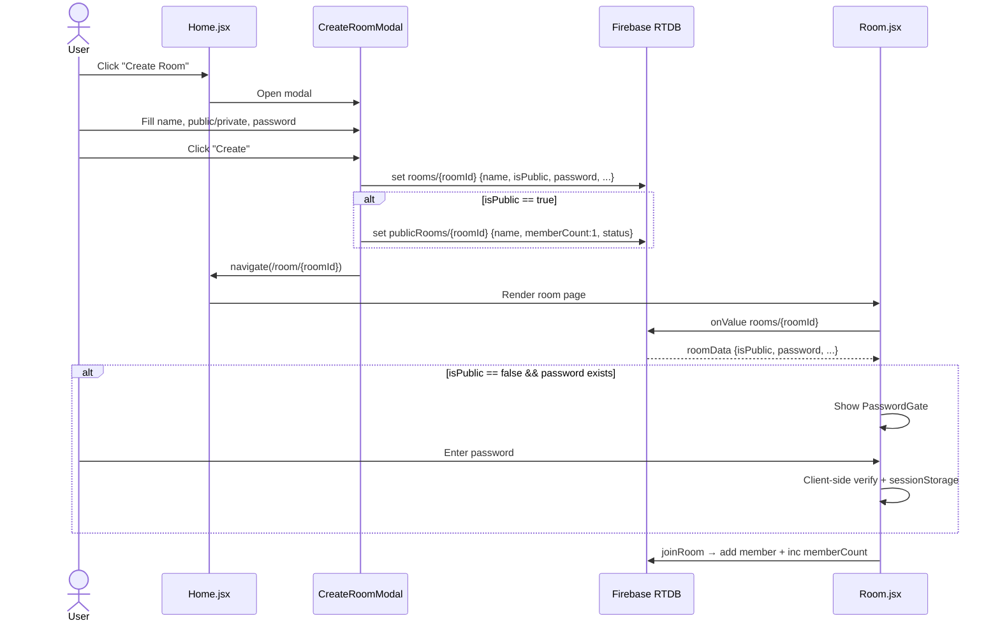

# Public/Private Room System — Architecture Plan

## Overview

Add a room creation modal with privacy options (public/private toggle, password) and a "Public Rooms" listing block on the home page.

---

## 1. Firebase RTDB Schema Changes

### Current `rooms/${roomId}` node

```js
{
  hostId: "uid",
  currentVideoId: "",
  playerType: "youtube",
  status: "idle",
  lastPosition: 0,
  updatedAt: serverTimestamp(),
  members: {
    uid: { name, ip, joinedAt }
  }
}
```

### New fields to add

```js
{
  // ... existing fields ...
  name: "My Room",          // string — user-chosen room name (max 32 chars)
  isPublic: true,           // boolean — public rooms appear in listing
  password: "abc123",       // string | null — optional, only for private rooms
}
```

### New `publicRooms` index node

A separate node for efficient querying of public rooms only (avoids scanning all rooms):

```
publicRooms/${roomId}/
  name: "My Room"
  memberCount: 3
  status: "idle" | "playing" | "paused"
  createdAt: <serverTimestamp>
```

This index is **updated by the client** whenever a room is created or its public status changes. In the future, this could be moved to a Cloud Function.

---

## 2. New Components

### [`CreateRoomModal.jsx`](watch-party/src/components/CreateRoomModal.jsx)

A modal dialog that replaces the current instant "Create Room" button behavior.

**Props:** `{ isOpen, onClose, onCreate }`

**State:**
- `roomName` (string, max 32 chars)
- `isPublic` (boolean, default: true)
- `password` (string, shown only when `isPublic === false`)
- `creating` (boolean, loading state)

**UI layout (Monopo Saigon style):**

```
┌──────────────────────────────────────────┐
│  ✕  (close button — top right)           │
│                                           │
│  CREATE ROOM          [11px uppercase]    │
│                                           │
│  Room Name                                │
│  ┌──────────────────────────────────┐     │
│  │ editorial-input                  │     │
│  └──────────────────────────────────┘     │
│                                           │
│  Visibility                               │
│  ┌─────────────────────────────┐          │
│  │ ● Public    ○ Private      │          │
│  └─────────────────────────────┘          │
│                                           │
│  [if Private selected]                    │
│  Password                                 │
│  ┌──────────────────────────────────┐     │
│  │ editorial-input type=password    │     │
│  └──────────────────────────────────┘     │
│                                           │
│  ┌──────────┐  ┌──────────────────┐       │
│  │  Cancel  │  │  Create Room     │       │
│  │ ghost    │  │  ghost-pill      │       │
│  └──────────┘  └──────────────────┘       │
└──────────────────────────────────────────┘
```

**On create:**
1. Generates roomId via existing [`generateRoomId()`](watch-party/src/pages/Home.jsx:14)
2. Calls `set(ref(database, "rooms/${roomId}"), { ...newFields })` — includes `name`, `isPublic`, `password`
3. Also writes to `publicRooms/${roomId}` index (only if `isPublic === true`)
4. Calls `onCreate(roomId)` which navigates to `/room/${roomId}`

### [`PasswordGate.jsx`](watch-party/src/components/PasswordGate.jsx)

A full-screen overlay shown before revealing room content for private rooms with passwords.

**Props:** `{ roomId, roomName, onVerified }`

**State:**
- `input` (string)
- `error` (boolean — wrong password shake)
- `verified` (boolean — stores in sessionStorage so re-enters don't re-prompt)

**UI:**
```
┌──────────────────────────────────┐
│                                  │
│   🔒 Private Room                │
│                                  │
│   "Room Name"                    │
│                                  │
│   Enter password to join:        │
│   ┌────────────────────────┐     │
│   │ password input         │     │
│   └────────────────────────┘     │
│                                  │
│   [  Join  ]                     │
│                                  │
│   [error message]                │
└──────────────────────────────────┘
```

### [`PublicRoomCard.jsx`](watch-party/src/components/PublicRoomCard.jsx)

A card component for the Public Rooms listing.

**Props:** `{ roomId, name, memberCount, status, onClick }`

**UI (inline, could be part of Home.jsx):**
```
┌──────────────────────────────────┐
│  Room Name                       │
│  ─────────────────────────       │
│  👥 3 members  ● [status]       │
│                                  │
│  [  Join  ]                      │
└──────────────────────────────────┘
```

---

## 3. Home.jsx Changes

### A. Replace instant Create Room with modal

**Current** [`handleCreateRoom`](watch-party/src/pages/Home.jsx:139):
- Generates roomId immediately
- Writes minimal room data
- Navigates to room

**New flow:**
1. Click "Create Room" button → opens `CreateRoomModal`
2. User fills in name, privacy, optional password
3. Click "Create Room" in modal → generates roomId, writes full data + publicRooms index, navigates

```jsx
const [showCreateModal, setShowCreateModal] = useState(false);

const handleCreateRoom = useCallback(async ({ roomName, isPublic, password }) => {
  const roomId = generateRoomId();
  const roomRef = ref(database, `rooms/${roomId}`);

  await set(roomRef, {
    hostId: user.uid,
    name: roomName,
    isPublic,
    password: isPublic ? null : (password || null),
    currentVideoId: "",
    status: "idle",
    lastPosition: 0,
    createdAt: serverTimestamp(),
  });

  // Write publicRooms index if public
  if (isPublic) {
    await set(ref(database, `publicRooms/${roomId}`), {
      name: roomName,
      memberCount: 1, // host counts as first member
      status: "idle",
      createdAt: serverTimestamp(),
    });
  }

  pushRecentRoom(roomId);
  navigate(`/room/${roomId}`);
}, [navigate, user]);
```

### B. Add Public Rooms section

Inserted **below the Create/Join cards** and **above Recent Rooms**:

```jsx
{/* ═══ Public Rooms — live from Firebase ═══ */}
<div className="w-full max-w-5xl mx-auto animate-fade-in"
     style={{ animationDelay: "150ms" }}>
  <h3 className="text-[11px] font-[400] uppercase tracking-[0.15em] text-felt-gray mb-[14px]">
    Public Rooms
  </h3>

  {publicRoomsLoading && (
    <p className="text-felt-gray text-[12px]">Loading...</p>
  )}

  {!publicRoomsLoading && publicRoomsList.length === 0 && (
    <p className="text-felt-gray text-[12px]">No public rooms yet. Create one to get started!</p>
  )}

  {publicRoomsList.length > 0 && (
    <div className="grid grid-cols-1 sm:grid-cols-2 lg:grid-cols-3 gap-4">
      {publicRoomsList.map((room) => (
        <div key={room.id}
             className="border border-white/15 p-6 bg-black/10 backdrop-blur-md rounded-3xl
                        flex flex-col gap-3 cursor-pointer hover:bg-white/5 transition-all"
             onClick={() => navigate(`/room/${room.id}`)}>
          <h4 className="text-white text-[14px] font-[500] truncate">
            {room.name}
          </h4>
          <div className="flex items-center gap-3 text-[11px] text-felt-gray">
            <span>👥 {room.memberCount}</span>
            <span className={`${room.status === "playing" ? "text-green-400" : "text-felt-gray"}`}>
              ● {room.status}
            </span>
          </div>
        </div>
      ))}
    </div>
  )}
</div>
```

### C. Data fetching for public rooms

```jsx
const [publicRoomsList, setPublicRoomsList] = useState([]);
const [publicRoomsLoading, setPublicRoomsLoading] = useState(true);

useEffect(() => {
  const publicRoomsRef = ref(database, "publicRooms");
  const unsubscribe = onValue(publicRoomsRef, (snapshot) => {
    const data = snapshot.val();
    if (!data) {
      setPublicRoomsList([]);
    } else {
      const list = Object.entries(data).map(([id, room]) => ({
        id,
        ...room,
      }));
      // Sort by createdAt descending (newest first)
      list.sort((a, b) => (b.createdAt || 0) - (a.createdAt || 0));
      setPublicRoomsList(list);
    }
    setPublicRoomsLoading(false);
  });
  return unsubscribe;
}, []);
```

---

## 4. Room.jsx Changes

### A. Password Gate integration

In [`RoomContent()`](watch-party/src/pages/Room.jsx:54), after loading auth and room data, check if room is private + has password:

```jsx
// After roomData loads
const [passwordVerified, setPasswordVerified] = useState(() => {
  // Check sessionStorage for this room
  try {
    return sessionStorage.getItem(`room_pw_${currentRoomId}`) === "verified";
  } catch { return false; }
});

const handlePasswordVerified = useCallback(() => {
  try {
    sessionStorage.setItem(`room_pw_${currentRoomId}`, "verified");
  } catch {}
  setPasswordVerified(true);
}, [currentRoomId]);

// Show password gate if needed
const needsPassword = roomData &&
  roomData.isPublic === false &&
  roomData.password &&
  !passwordVerified;

if (needsPassword) {
  return (
    <PasswordGate
      roomId={currentRoomId}
      roomName={roomData.name || currentRoomId}
      password={roomData.password}
      onVerified={handlePasswordVerified}
    />
  );
}
```

### B. PasswordGate component logic

```jsx
export default function PasswordGate({ roomId, roomName, password, onVerified }) {
  const [input, setInput] = useState("");
  const [error, setError] = useState(false);

  const handleSubmit = () => {
    if (input === password) {
      onVerified();
    } else {
      setError(true);
      setTimeout(() => setError(false), 500);
    }
  };

  return (
    <div className="min-h-screen bg-obsidian flex items-center justify-center">
      <div className="border border-white/15 p-10 bg-black/10 backdrop-blur-md rounded-3xl
                      flex flex-col gap-6 max-w-md w-full mx-4">
        <h2 className="text-white text-[12px] font-semibold uppercase tracking-[0.2em]">
          Private Room
        </h2>
        <p className="text-white/70 text-[14px]">
          "{roomName}" requires a password to join.
        </p>
        <input
          type="password"
          value={input}
          onChange={(e) => { setInput(e.target.value); setError(false); }}
          onKeyDown={(e) => e.key === "Enter" && handleSubmit()}
          placeholder="Enter password..."
          className={`editorial-input text-sm ${error ? "border-red-500 animate-shake" : ""}`}
        />
        <button onClick={handleSubmit} className="ghost-pill self-start">
          Join Room
        </button>
        {error && (
          <p className="text-red-400 text-[11px]">Incorrect password. Try again.</p>
        )}
      </div>
    </div>
  );
}
```

---

## 5. useRoom.js Changes

### A. [`createRoom()`](watch-party/src/hooks/useRoom.js:64)

Already writes host + room data with `hostId`, `members`, etc. The **Home.jsx** now creates the room skeleton (name, isPublic, password) before navigating, so `useRoom.createRoom` becomes a secondary call that adds the host member. OR we restructure so that:

- **Home.jsx** creates full room (including name, isPublic, password, publicRooms index)
- **RoomContext** / **useRoom** only adds the member and subscribes

This is cleaner — Home.jsx does the room creation with all metadata, RoomContext just joins.

### B. [`joinRoom()`](watch-party/src/hooks/useRoom.js:93)

When a member joins, also increment `memberCount` on the room and on `publicRooms/${roomId}`:

```jsx
const joinRoom = useCallback(async () => {
  if (!user || !roomId) return;

  const memberRef = ref(database, `rooms/${roomId}/members/${user.uid}`);
  const ip = await getPublicIp();

  await set(memberRef, {
    name: displayName || "Anonymous",
    ip: ip,
    joinedAt: serverTimestamp(),
  });

  // Increment memberCount in both room and publicRooms index
  const roomRef = ref(database, `rooms/${roomId}`);
  await update(roomRef, { memberCount: serverIncrement(1) });

  const publicRoomsRef = ref(database, `publicRooms/${roomId}`);
  await update(publicRoomsRef, { memberCount: serverIncrement(1) });
}, [roomId, user, displayName]);
```

### C. [`leaveRoom()`](watch-party/src/hooks/useRoom.js:109)

Decrement `memberCount`:

```jsx
const leaveRoom = useCallback(async () => {
  if (!user || !roomId) return;

  const memberRef = ref(database, `rooms/${roomId}/members/${user.uid}`);
  await set(memberRef, null);

  await update(ref(database, `rooms/${roomId}`), { memberCount: serverIncrement(-1) });
  await update(ref(database, `publicRooms/${roomId}`), { memberCount: serverIncrement(-1) });
}, [roomId, user]);
```

**Note:** Firebase RTDB doesn't have a native `serverIncrement` — need to use `increment` from `firebase/database`:
```js
import { increment } from "firebase/database";
```

---

## 6. RoomContext.jsx Changes

### A. Join flow modification

Current logic in [`RoomProvider`](watch-party/src/context/RoomContext.jsx:57-89):
1. Check if room exists
2. If not → createRoom()
3. If exists → joinRoom()

**New logic:**
1. Check if room exists
2. If not → createRoom() (this now writes member data too)
3. If exists → joinRoom()
4. Password verification is handled in [`RoomContent()`](watch-party/src/pages/Room.jsx:54) — the RoomProvider is NOT responsible for password gating, it just joins the room in Firebase. The visual gate is in RoomContent.

This means **no change** to RoomContext's join flow — password gating is purely UI-side rendered in Room.jsx based on roomData.

---

## 7. Firebase Security Rules (optional but recommended)

```json
{
  "rules": {
    "rooms": {
      "$roomId": {
        ".read": true,
        ".write": "!data.exists() || (data.child('hostId').val() === auth.uid)",
        "members": {
          "$uid": {
            ".write": "$uid === auth.uid"
          }
        }
      }
    },
    "publicRooms": {
      ".read": true,
      ".write": "newData.child('name').isString()"
    }
  }
}
```

---

## 8. Implementation Order

1. **`firebase.js`** — export `increment` from `firebase/database`
2. **[`CreateRoomModal.jsx`](watch-party/src/components/CreateRoomModal.jsx)** — new component with form
3. **`useRoom.js`** — add `increment` imports, update `joinRoom`/`leaveRoom` to update `memberCount`
4. **`Home.jsx`** — replace `handleCreateRoom`, add modal state, add public rooms query + listing
5. **[`PasswordGate.jsx`](watch-party/src/components/PasswordGate.jsx)** — new component
6. **`Room.jsx`** — add password gate logic before main content
7. **Build test** — `npm run build` to verify no errors

---

## 9. Data Flow Diagram



---

## 10. Visual Mockup — Home Page with Public Rooms

```
┌──────────────────────────────────────────────────────┐
│  Watch Party                                         │
│                                                       │
│  ┌──────────────────────────────────────┐             │
│  │    🌈 Iridescent gradient hero       │             │
│  │                                      │             │
│  │    Watch Party                       │             │
│  │    Watch YouTube with friends...     │             │
│  │                                      │             │
│  │    You are [GuestName]               │             │
│  │                                      │             │
│  │  ┌────────────┐  ┌────────────┐     │             │
│  │  │Create Room │  │ Join Room  │     │             │
│  │  │            │  │ [input] Go │     │             │
│  │  └────────────┘  └────────────┘     │             │
│  │                                      │             │
│  │  ── PUBLIC ROOMS ──                  │             │
│  │  ┌──────────┐ ┌──────────┐ ┌──────┐ │             │
│  │  │Movie Night│ │Game Stream│ │...   │ │             │
│  │  │👥 3 ● idle│ │👥 5 ● play│ │      │ │             │
│  │  └──────────┘ └──────────┘ └──────┘ │             │
│  │                                      │             │
│  │  ── RECENT ROOMS ──                  │             │
│  │  [abc123] [xyz789]                    │             │
│  │                                      │             │
│  │  Download Desktop App                │             │
│  └──────────────────────────────────────┘             │
└──────────────────────────────────────────────────────┘
```
