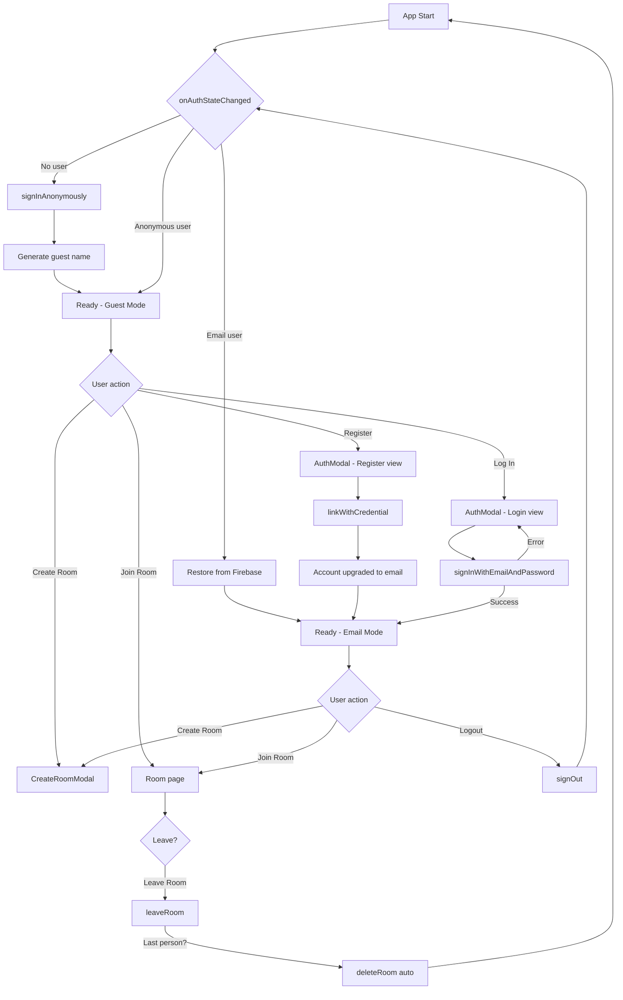

# Registration & Login System Plan

## 1. Current State

The app currently uses **only anonymous Firebase Auth** (`signInAnonymously`):

- [`useAuth`](watch-party/src/hooks/useAuth.js) — auto-generates guest names like `BravePanda42`, stores displayName in localStorage
- [`Home.jsx`](watch-party/src/pages/Home.jsx) — shows a [`ProfileCard`](watch-party/src/pages/Home.jsx:37) with the display name
- No email/password registration, no login screen, no logout button on home page
- When users refresh, anonymous auth preserves the session, but clearing browser data = new identity

---

## 2. Target State

Support **two authentication modes**, with the ability to **upgrade from anonymous to email/password**:

### Auth Modes

| Mode | Onboarding | Identity Persistence | Room Data |
|------|-----------|---------------------|-----------|
| **Guest (Anonymous)** | Auto-sign-in on first visit | Session/ephemeral; lost if Firebase deletes anonymous account | Tied to temporary UID |
| **Email/Password** | Manual registration with email + password | Permanent; survives across devices/browsers | Tied to permanent UID (or linked from anonymous) |

### Auth State Machine

```
[App Start]
    ↓
[Auth Check] ─→ (no session) ─→ [Anonymous Sign-In (auto)]
    ↓                                       ↓
(session exists)                    [Guest Mode]
    ↓                                       ↓
[Ready] ←── [Register with Email] ←── [Upgrade via linkWithCredential]
    ↓                                       ↓
[Ready] ←── [Login with Email] ────── [Permanent Account]
```

### Key Firebase Auth Methods

| Method | Import | Purpose |
|--------|--------|---------|
| `signInAnonymously` | `firebase/auth` | Guest entry (existing) |
| `createUserWithEmailAndPassword` | `firebase/auth` | Register new account |
| `signInWithEmailAndPassword` | `firebase/auth` | Login existing account |
| `sendPasswordResetEmail` | `firebase/auth` | Forgot password |
| `EmailAuthProvider.credential` | `firebase/auth` | Build credential for linking |
| `linkWithCredential` | `firebase/auth` | Upgrade anonymous → email |
| `onAuthStateChanged` | `firebase/auth` | Listen to auth state (existing) |
| `updateProfile` | `firebase/auth` | Set displayName (existing) |
| `signOut` | `firebase/auth` | Logout (existing) |

No additional packages needed — all are in `firebase/auth`.

---

## 3. Files to Create / Modify

### 3.1 NEW: [`src/components/AuthModal.jsx`](watch-party/src/components/AuthModal.jsx)

A slide-in modal with **3 view states**:

```
AuthModal
├── view: "login"
│   ├── Email input
│   ├── Password input
│   ├── [Log In] button
│   ├── "Forgot password?" link → switches to view "reset"
│   └── "Don't have an account? Register" link → switches to view "register"
│
├── view: "register"
│   ├── Email input
│   ├── Password input
│   ├── Confirm password input
│   ├── Display name input (optional, defaults to email local-part)
│   ├── [Create Account] button
│   └── "Already have an account? Log In" link → switches to view "login"
│
└── view: "reset"
    ├── Email input
    ├── [Send Reset Link] button
    ├── Success message "Check your email" (if sent)
    └── "Back to Login" link → switches to view "login"
```

**Props:**
- `isOpen: boolean`
- `onClose: () => void`
- `initialView?: "login" | "register"` (default: "login")

**Internal state:**
- `view` — current view (login/register/reset)
- `email`, `password`, `confirmPassword`, `displayName` — form fields
- `error` — error message string (null on success)
- `submitting` — loading state
- `resetSent` — boolean for password reset success

**Styling:**
- Same design language as [`CreateRoomModal`](watch-party/src/components/CreateRoomModal.jsx): dark overlay (`bg-obsidian/80`), centered panel (`bg-inkstone`), same close button, same typography
- Inputs: matching `editorial-input` style
- Error messages: red-400 text, 11px, below the form

### 3.2 MODIFY: [`src/hooks/useAuth.js`](watch-party/src/hooks/useAuth.js)

Add the following exports to the existing hook:

```javascript
// New imports needed:
import {
  createUserWithEmailAndPassword,
  signInWithEmailAndPassword,
  sendPasswordResetEmail,
  EmailAuthProvider,
  linkWithCredential,
} from "firebase/auth";

// New state:
const [authMethod, setAuthMethod] = useState(null); // "anonymous" | "email" | null

// Detect auth method from onAuthStateChanged:
//   user?.isAnonymous === true → "anonymous"
//   user?.isAnonymous === false → "email"

// New methods:

// 1. registerWithEmail(email, password, displayName)
//    - Creates account via createUserWithEmailAndPassword
//    - If current user is anonymous → linkWithCredential instead
//    - Sets displayName via updateProfile
//    - Stores displayName in localStorage
//    - Returns the user credential

// 2. loginWithEmail(email, password)
//    - Signs in via signInWithEmailAndPassword
//    - Restores displayName from Firebase Auth profile or localStorage
//    - Returns the user credential

// 3. resetPassword(email)
//    - Calls sendPasswordResetEmail
//    - Returns void (throws on error)

// 4. Modified login() (anonymous)
//    - Keep existing behavior
//    - Only allowed if no user is currently signed in (or if anonymous)

// 5. Modified logout()
//    - Keep existing behavior
//    - Clears authMethod state

// 6. Add: getAuthMethod(user) helper
//    - user?.isAnonymous → "anonymous"
//    - user && !user.isAnonymous → "email"
//    - no user → null
```

**Important logic for anonymous → email upgrade:**

```javascript
const registerWithEmail = async (email, password, displayName) => {
  let userCredential;

  if (user && user.isAnonymous) {
    // Upgrade anonymous account: link credential
    const credential = EmailAuthProvider.credential(email, password);
    userCredential = await linkWithCredential(user, credential);
  } else {
    // Fresh registration
    userCredential = await createUserWithEmailAndPassword(auth, email, password);
  }

  // Set display name
  await updateProfile(userCredential.user, { displayName: displayName || email.split("@")[0] });
  localStorage.setItem(STORAGE_KEY, displayName);
  setDisplayName(displayName);
  setAuthMethod("email");

  return userCredential;
};
```

**Return value changes:**

```javascript
return {
  user,
  loading,
  displayName,
  authMethod,        // NEW: "anonymous" | "email" | null
  login,             // anonymous sign-in (existing)
  logout,            // sign out (existing)
  registerWithEmail, // NEW
  loginWithEmail,    // NEW
  resetPassword,     // NEW
  updateDisplayName, // existing
};
```

### 3.3 MODIFY: [`src/pages/Home.jsx`](watch-party/src/pages/Home.jsx)

**Changes to the component:**

1. **Import `AuthModal`** at the top
2. **Add state** for auth modal visibility + initial view:
   ```javascript
   const [authModalOpen, setAuthModalOpen] = useState(false);
   const [authModalView, setAuthModalView] = useState("login"); // "login" | "register"
   ```
3. **Destructure new methods** from `useAuth()`:
   ```javascript
   const { displayName, loading, updateDisplayName, authMethod, logout, registerWithEmail, loginWithEmail, resetPassword } = useAuth();
   ```
4. **Add Auth controls** to the header / hero area:

```
┌──────────────────────────────────────────┐
│  Watch Party    [Guest]  [Register] [Login] │
└──────────────────────────────────────────┘
   OR (when logged in with email):
┌──────────────────────────────────────────┐
│  Watch Party    [user@email.com]  [Logout] │
└──────────────────────────────────────────┘
```

**Specific UI placement:**

Replace or augment the [`ProfileCard`](watch-party/src/pages/Home.jsx:231-237) section. The ProfileCard stays for display name editing, but add:

- If `authMethod === "anonymous"`:
  - Small tag/badge showing "Guest" mode
  - "Register" button → opens `AuthModal` with `initialView="register"`
  - "Log In" button → opens `AuthModal` with `initialView="login"`

- If `authMethod === "email"`:
  - Show user email (from `user.email`)
  - "Logout" button → calls `logout()`

**Pass auth modal handlers:**

```jsx
<AuthModal
  isOpen={authModalOpen}
  onClose={() => setAuthModalOpen(false)}
  initialView={authModalView}
/>
```

### 3.4 MODIFY: [`src/pages/Room.jsx`](watch-party/src/pages/Room.jsx)

The room page already has the header with display name editing and log out. Minimal changes:

- Add a small auth badge next to the display name showing "Guest" or the user's email
- The existing ✕ (leave room) button stays; we could add a Logout from account button in the header too (not just leave room)

Actually, let me reconsider. The Room page already has `leaveRoom` which leaves the room. A separate "Sign Out" button would sign out of Firebase entirely. This is a different action.

I'll add a small "Sign Out" link in the Room header, but keep it subtle since the user is focused on watching.

---

## 4. Detailed Component Design

### 4.1 AuthModal Component Structure

```
┌────────────────────────────────────────────┐
│  ✕  (close button - top right)             │
│                                            │
│  ┌── Login ───────────────────────────┐    │
│  │                                     │    │
│  │  Email                              │    │
│  │  ┌─────────────────────────────────┐│    │
│  │  │ user@example.com                ││    │
│  │  └─────────────────────────────────┘│    │
│  │                                     │    │
│  │  Password                           │    │
│  │  ┌─────────────────────────────────┐│    │
│  │  │ •••••••••                       ││    │
│  │  └─────────────────────────────────┘│    │
│  │                                     │    │
│  │  ┌─────────────────────────────────┐│    │
│  │  │          Log In                 ││    │
│  │  └─────────────────────────────────┘│    │
│  │                                     │    │
│  │  Forgot password?                   │    │
│  │  Don't have an account? Register    │    │
│  └─────────────────────────────────────┘    │
└────────────────────────────────────────────┘
```

### 4.2 Form Validation

| Field | Rules |
|-------|-------|
| Email | Required, must match `/^[^\s@]+@[^\s@]+\.[^\s@]+$/` |
| Password | Required, min 6 chars (Firebase requirement) |
| Confirm Password | Required (register only), must match password |
| Display Name | Optional (register only), defaults to email local-part, max 24 chars |

### 4.3 Error Handling

Map Firebase error codes to user-friendly messages:

| Firebase Error Code | Message |
|--------------------|---------|
| `auth/email-already-in-use` | "This email is already registered. Try logging in instead." |
| `auth/invalid-email` | "Please enter a valid email address." |
| `auth/weak-password` | "Password must be at least 6 characters." |
| `auth/wrong-password` | "Incorrect password. Try again." |
| `auth/user-not-found` | "No account found with this email." |
| `auth/invalid-credential` | "Invalid email or password." |
| `auth/too-many-requests` | "Too many attempts. Please wait a moment and try again." |
| `auth/network-request-failed` | "Network error. Check your connection and try again." |
| Default | "Something went wrong. Please try again." |

---

## 5. Edge Cases & Race Conditions

| Scenario | Handling |
|----------|----------|
| User registers while already logged in as guest | `linkWithCredential` upgrades the anonymous account; UID stays the same |
| User logs in with email while anonymous session exists | Firebase Auth replaces the anonymous user; old anonymous UID data is orphaned. We should **offer linking** instead of silent replacement |
| User clicks "Register" but email already exists | Show inline error; offer "Log In" link |
| User navigates away while registration is submitting | Disable button + show spinner; navigation cancels the operation |
| Network fails during `linkWithCredential` | Show error; user can retry; anonymous session is preserved |
| Password reset email bounces | Firebase sends success regardless; we show "Check your email" and let Firebase handle delivery |
| Anonymous account is cleaned up by Firebase (90 days) | App generates new anonymous identity automatically; displayName restored from localStorage |
| User registers, logs out, logs in on another device | `signInWithEmailAndPassword` returns the same account; displayName from Firebase Auth profile |

---

## 6. Implementation Order

1. **`useAuth.js`** — Add all new auth methods (`registerWithEmail`, `loginWithEmail`, `resetPassword`, `authMethod`), import new Firebase functions, implement anonymous→email linking
2. **`AuthModal.jsx`** — Create the modal component with 3 views (login/register/reset), form validation, error display
3. **`Home.jsx`** — Integrate AuthModal, add auth status display (guest/email badge), register/login/logout buttons
4. **`Room.jsx`** — Add small auth indicator + sign-out option in the room header
5. **Build & verify** — `npm run build` with 0 errors
6. **Push to GitHub**

---

## 7. Data Flow Diagram



---

## 8. Visual Style Reference

The auth modal should match the app's existing design language:

- **Background overlay**: `bg-obsidian/80` (same as CreateRoomModal)
- **Panel**: `bg-inkstone` with `border border-white/15`, `rounded-3xl`, `p-[34px]`
- **Title**: `text-[11px] font-[400] uppercase tracking-[0.15em]` (like "Desktop Feature" in Room.jsx)
- **Inputs**: Same `editorial-input` class or the `border border-white/30 bg-white/5 px-6 py-3` style from Home.jsx join input
- **Buttons**: `ghost-pill` class for primary actions
- **Error text**: `text-red-400 text-[11px]`
- **Links**: `text-ash-mist hover:text-paper text-[11px] cursor-pointer`
- **Spinner**: Same `w-4 h-4 border border-white/30 border-t-white animate-spin rounded-none`
