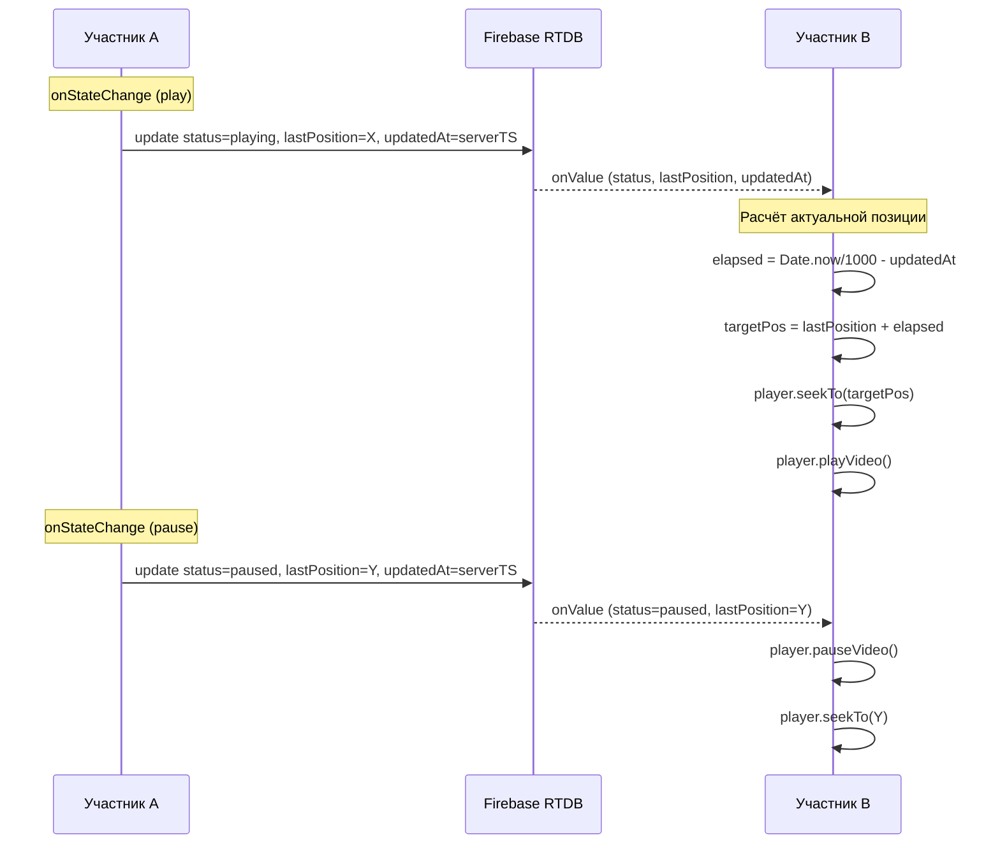

# Watch Party MVP — Architecture & Sync Plan

## 1. PRD (1 страница): User Flow комнаты

### Проблема
Друзья хотят смотреть YouTube-видео одновременно, но нет простого способа синхронизировать просмотр и общаться в реальном времени.

### Решение (MVP)
Веб-приложение, где пользователь создаёт комнату, кидает ссылку друзьям, и все смотрят одно видео синхронно с чатом.

### User Flow

```
[Пользователь] → Авторизация (анонимно / Google)
       ↓
   Создаёт комнату → Получает ссылку вида /room/:id
       ↓
   Кидает ссылку друзьям
       ↓
   Все вставляют / выбирают YouTube-ссылку
       ↓
   Любой нажимает Play → Видео стартует у всех одновременно
       ↓
   Чат + синхронизация плэйбека (любой может управлять)
       ↓
   При опоздании — автоматический расчёт позиции через serverTimestamp
```

### Ключевые сценарии MVP

| Сценарий | Описание |
|----------|----------|
| Создание комнаты | Любой авторизованный пользователь создаёт комнату → получает shareable-ссылку |
| Вход по ссылке | Участник открывает ссылку → попадает в комнату (авторизация опциональна) |
| Выбор видео | Любой участник вставляет YouTube URL или ID |
| Синхронный просмотр | Все участники видят одно и то же время видео |
| Базовый чат | Текстовые сообщения в реальном времени внутри комнаты |
| Анти-рассинхрон | Событийная синхронизация через serverTimestamp, без heartbeat |

### Non-goals MVP
- Список друзей / социальный граф
- Очередь видео (плейлист)
- Десктоп-клиент
- Видеозвонки / голосовой чат

---

## 2. Инициализация проекта (пошаговая инструкция)

### Шаг 1: Создать React + Vite проект
```bash
npm create vite@latest watch-party -- --template react
cd watch-party
npm install
```

### Шаг 2: Установить Firebase
```bash
npm install firebase
```

### Шаг 3: Установить React Router (для роутинга комнат)
```bash
npm install react-router-dom
```

### Шаг 4: (Опционально) Tailwind CSS для быстрой стилизации
```bash
npm install -D tailwindcss @tailwindcss/vite
```

### Шаг 5: Создать Firebase-проект
1. Зайти в [console.firebase.google.com](https://console.firebase.google.com)
2. Создать проект (или использовать существующий)
3. Authentication → включить **Anonymous** и **Google**
4. Realtime Database → создать в **test mode**
5. Web-приложение → скопировать `firebaseConfig`

### Шаг 6: Файл конфигурации
Создать [`src/lib/firebase.js`]() с firebaseConfig.

---

## 3. Масштабируемая архитектура папок (frontend)

```
src/
├── lib/                    # Firebase, API-клиенты
│   └── firebase.js
├── hooks/                  # Кастомные React-хуки
│   ├── useRoom.js          # Логика комнаты (подписка Firebase)
│   ├── useVideoSync.js     # YouTube Player + синхронизация
│   └── useAuth.js          # Авторизация
├── pages/                  # Страницы (роутинг)
│   ├── Home.jsx            # Лендинг / Создать комнату
│   ├── Room.jsx            # Комната просмотра
│   └── NotFound.jsx
├── components/             # UI-компоненты (переиспользуемые)
│   ├── VideoPlayer.jsx     # Обёртка YouTube IFrame API
│   ├── Chat.jsx            # Чат-компонент
│   ├── ChatMessage.jsx     # Отдельное сообщение
│   ├── RoomHeader.jsx      # Шапка комнаты (ссылка, кнопки)
│   └── AuthGate.jsx        # Блок авторизации
├── context/                # React Context (опционально)
│   └── RoomContext.jsx
├── utils/                  # Утилиты
│   ├── syncHelpers.js      # Расчёт актуальной позиции (elapsed + lastPosition)
│   └── roomHelpers.js      # Генерация ID, валидация
├── styles/                 # Глобальные стили
│   └── index.css
├── App.jsx                 # Роутер + AuthProvider
└── main.jsx                # Entry point
```

### Принципы архитектуры
- **Хуки** → вся бизнес-логика; компоненты — только рендер.
- **lib/** → только firebase singleton и "голые" SDK-вызовы.
- **pages/** → 1 файл = 1 маршрут, композиция из components.
- **utils/** → чистые функции без сайд-эффектов.

---

## 4. Логика синхронизации YouTube Player API через Firebase

### 4.1. Модель данных в Firebase Realtime Database

```
/rooms/
  └── {roomId}/
      ├── hostId: string              // uid создателя
      ├── videoId: string             // YouTube Video ID
      ├── status: "playing"|"paused"|"idle"
      ├── lastPosition: number        // время в секундах на момент события
      ├── updatedAt: serverTimestamp  // серверная метка последнего события
      ├── members: {
      │     └── {uid}: {
      │         name: string,
      │         joinedAt: number
      │       }
      └── messages: {
            └── {msgId}: {
                uid: string,
                name: string,
                text: string,
                timestamp: number
              }
      }
```

### 4.2. Контроль — любой участник

- **Нет разделения на хост/гость** в управлении плеером.
- Любой участник комнаты может нажать Play/Pause или перемотать видео.
- Любое действие отправляет новое состояние в Firebase: `status`, `lastPosition`, `updatedAt`.
- Все остальные участники подписаны на изменения и применяют их.
- `hostId` сохраняется как мета-информация (кто создал), но не даёт привилегий по управлению.

### 4.3. Event-driven синхронизация (без heartbeat)

**Принцип:** Данные в Firebase пишутся **только по событиям** (PLAY, PAUSE, SEEK). Никаких периодических heartbeat-запросов.

| Действие | Кто вызывает | Что пишет в Firebase |
|----------|-------------|---------------------|
| Play | Любой | `status: "playing"`, `lastPosition`, `updatedAt: serverTimestamp` |
| Pause | Любой | `status: "paused"`, `lastPosition`, `updatedAt: serverTimestamp` |
| Seek (перемотка) | Любой | `status: "playing"` (если до этого было playing), `lastPosition` (новое), `updatedAt: serverTimestamp` |
| Смена видео | Любой | `videoId`, `lastPosition: 0`, `status: "idle"`, `updatedAt: serverTimestamp` |

**Важно:** `lastPosition` записывается **на момент события**, а `updatedAt` — это `firebase.database.ServerTimestamp`. Это ключевая пара для расчёта актуальной позиции.

### 4.4. Обработка рассинхрона (расчёт дельты через elapsed time)

Главное отличие от предыдущей версии — **низкая частота записи в Firebase** и **расчёт времени локально** на клиенте.

#### 4.4.1. Когда клиент получает событие `status: "playing"`

```
актуальная_позиция = lastPosition + (Date.now() / 1000 - updatedAt_в_секундах)
```

- `lastPosition` — время видео на момент, когда кто-то нажал Play
- `(Date.now() - updatedAt)` — сколько секунд прошло с момента события
- Клиент делает `player.seekTo(актуальная_позиция)` **один раз**
- Дальше плеер играет самостоятельно — никаких дополнительных seekTo

#### 4.4.2. Когда клиент получает событие `status: "paused"`

- Клиент делает `player.pauseVideo()` немедленно
- Дополнительно: если плеер ушёл вперёд из-за сетевой задержки, `player.seekTo(lastPosition)`

#### 4.4.3. Обработка разницы часов (clock skew)

`updatedAt` — это Firebase `serverTimestamp`, одинаковый для всех клиентов.
`Date.now()` — локальное время клиента, но разница в миллисекундах некритична для допуска в 1 сек.

**Итог:** рассинхрон между клиентами накапливается только за счёт:
1. Разницы во времени получения события через Firebase (обычно < 200 мс)
2. Разницы в скорости сети/декодирования видео

#### 4.4.4. Допуск (threshold)

- Если `|актуальная_позиция - localPlayer.getCurrentTime()| > 1.0 сек` → `seekTo()`
- Если `<= 1.0 сек` → игнорируем (допустимый дрифт)



### 4.5. Детали реализации

- **YouTube IFrame API** загружается через `script` в `VideoPlayer.jsx`.
- Все участники имеют **полный доступ к контроллам** плеера (play/pause/seek).
- `useVideoSync.js` — кастомный хук, который:
  - Подписывается на `rooms/{roomId}/status`, `rooms/{roomId}/lastPosition`, `rooms/{roomId}/updatedAt`
  - Подписывается на события YouTube Player (`onStateChange`, `onReady`)
  - При локальном действии пользователя (play/pause/seek) пишет новое состояние в Firebase
  - При получении события из Firebase рассчитывает дельту и применяет seekTo при необходимости
  - Использует `serverTimestamp` для единой временной метки
- **Защита от петель (loop guard)**: при получении события из Firebase хук проверяет source события — если оно пришло из Firebase (не локальное), то не шлёт его обратно.

### 4.6. Обработка опоздавших участников

1. При входе в комнату новый участник читает `status`, `lastPosition`, `updatedAt` из Firebase **один раз** (`.once()`).
2. Если `status === "playing"`:
   ```
   elapsed = Date.now() / 1000 - updatedAt
   targetPosition = lastPosition + elapsed
   player.seekTo(targetPosition)
   player.playVideo()
   ```
3. Если `status === "paused"`:
   ```
   player.seekTo(lastPosition)
   player.pauseVideo()
   ```
4. После этого участник подписывается на `onValue` и реагирует на новые события как все.

---

## 5. Roadmap ближайших шагов

1. Инициализировать проект (шаги из секции 2)
2. Настроить Firebase (Auth + RTDB)
3. Реализовать `useAuth.js` (анонимная авторизация)
4. Реализовать `useRoom.js` (создание / вступление в комнату)
5. Реализовать `useVideoSync.js` — **ключевой хук** с event-driven синхронизацией (расчёт elapsed time, loop guard)
6. Реализовать `VideoPlayer.jsx` — обёртка YouTube IFrame API с полным доступом к контроллам
7. Реализовать `Chat.jsx` (чтение/запись сообщений в Firebase)
8. Связать всё в `Room.jsx`
9. Deploy (Firebase Hosting / Vercel)
